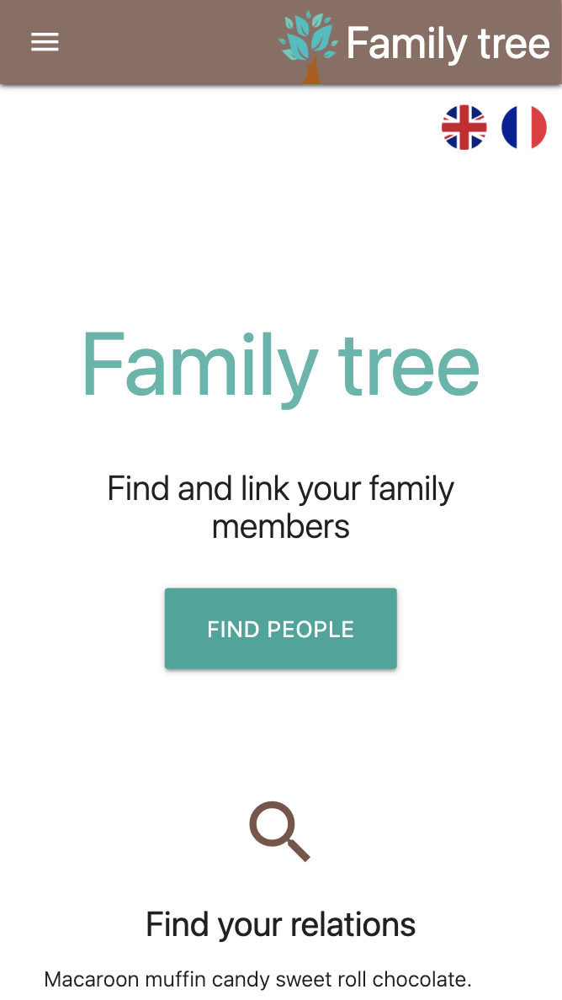
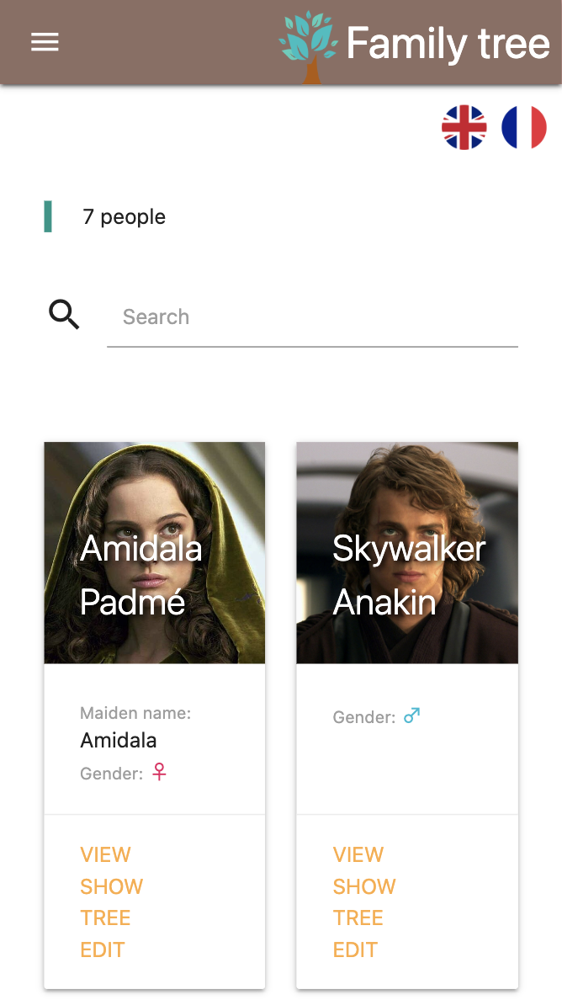
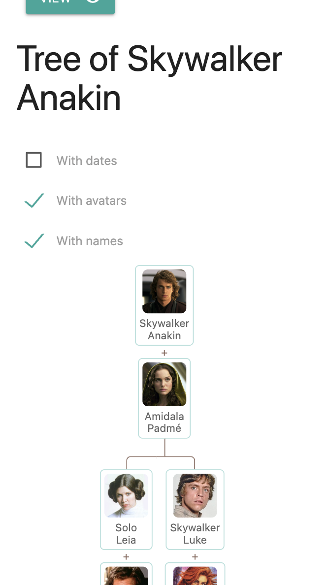
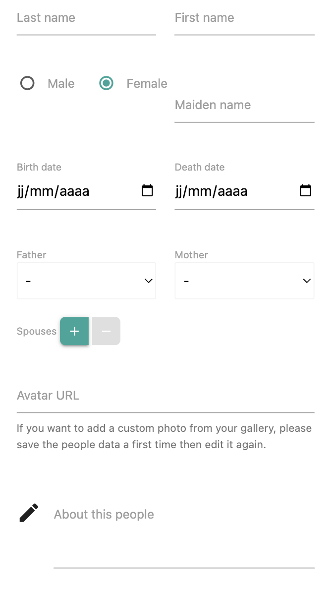

# family tree

A tiny web app to manage family trees. It is built with backbone.js and node.js, and uses mongoDB as the database.

   

## install

```bash
npm i
```

## start dev server

```bash
docker compose up
npm start

// example with env vars
ACCESS_USERS="myuser:mypassword:5b47c1eb252696382be9daae;otheruser:otherpassword:" DB_URL="mongodb://localhost:27017" DB_NAME=familytree npm start
```

## build prod files

```bash
npm run build
```

## troubleshooting

During `npm i`, if an error is faced about "ModuleNotFoundError: No module named 'distutils'" (node-sass setup), let's run `brew install python-setuptools`.
